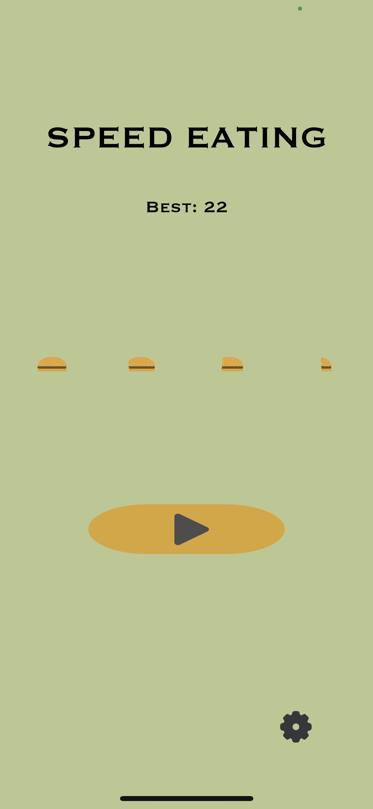
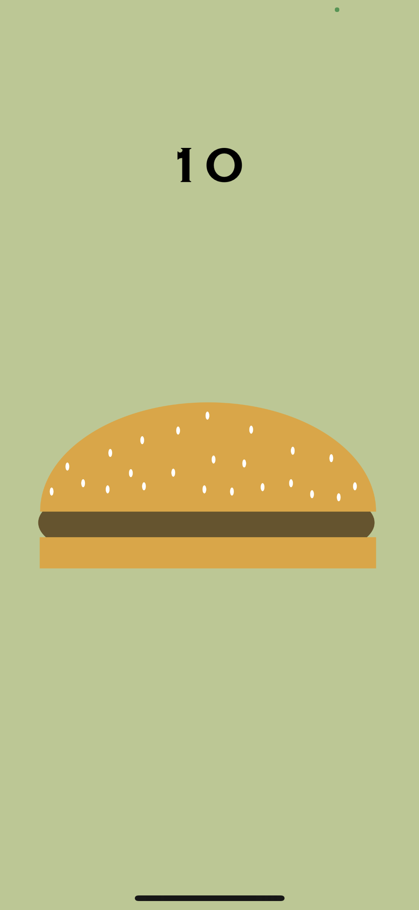

# Speed Eater

  

Speed Eater is a mobile game that utilizes Apple's True Depth camera. Your goal is to eat the most amount of 
hamburgers that you can in 30 seconds by moving your mouth in real life. This app uses Vungle for ad support which players
can remove by paying $1.99 or scoring 40 or higher in a round.
